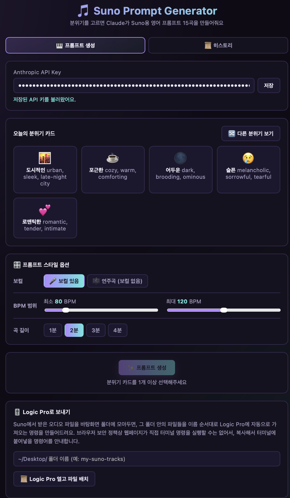
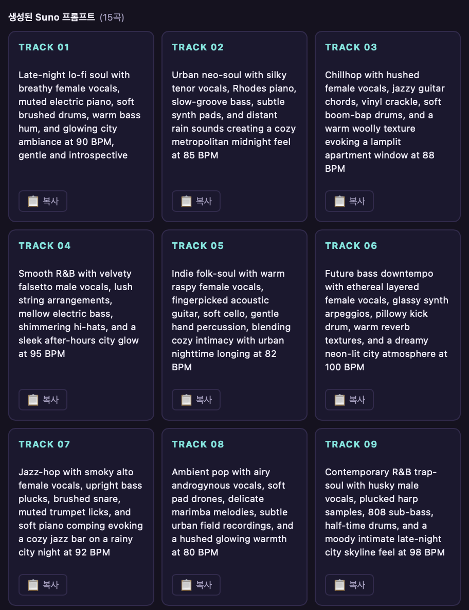
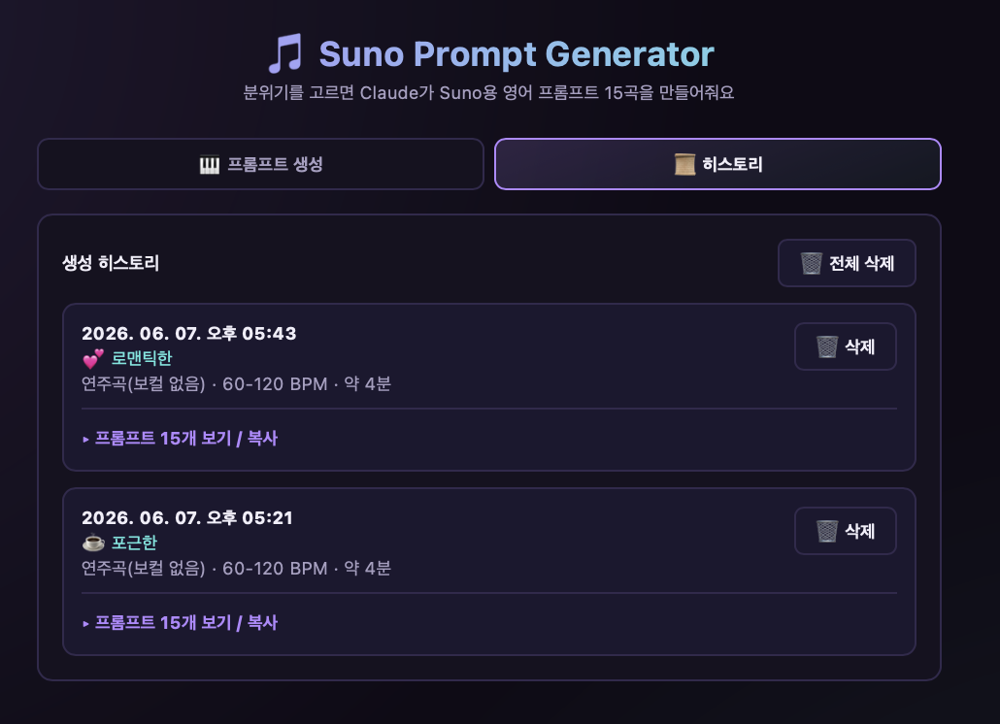

# 🎵 Suno Prompt Generator (suno-agent)

[한국어](#한국어) | [English](#english)

---

## 한국어

### 소개
Suno Prompt Generator는 Anthropic Claude API를 이용해 선택한 음악 분위기에 맞는 Suno AI용 영어
프롬프트를 자동으로 생성해주는 다크 모드 웹앱입니다. 분위기 카드를 고르고 보컬 유무·BPM·곡 길이 같은
스타일 옵션을 정하면, Claude가 서로 다른 15개의 프롬프트를 한 번에 만들어줍니다. 생성된 프롬프트는
카드 형태로 표시되어 복사 버튼으로 바로 가져갈 수 있고, 히스토리 탭에서 이전 결과를 다시 확인·복사·삭제할
수 있습니다. Logic Pro 연동 기능으로 완성된 오디오 파일들을 순서대로 자동 가져오는 명령도 만들 수
있습니다.

### 주요 기능
- 음악 분위기 카드 5개를 랜덤 표시, "다른 분위기 보기"로 새로 고침
- 보컬 유무 토글, BPM 범위(60~180) 슬라이더, 곡 길이(1~4분) 선택 등 스타일 옵션
- Claude API 호출로 Suno용 영어 프롬프트 15곡 생성
- 결과 카드 + 1클릭 복사 버튼
- 생성 히스토리를 localStorage에 저장하고 날짜별로 조회·복사·삭제
- Logic Pro 자동 가져오기 AppleScript 연동

### 사용 방법

1. **API 키 발급받기**
   - [Anthropic Console](https://console.anthropic.com/)에 가입/로그인합니다.
   - 좌측 메뉴의 "API Keys"에서 새 키를 생성합니다 (`sk-ant-...` 형식의 문자열).
   - 결제 정보 등록이 필요할 수 있으며, 사용량에 따라 과금됩니다.

2. **앱 실행**
   - `index.html` 파일을 더블클릭하거나 브라우저로 열면 바로 실행됩니다.
   - (선택) 로컬 서버로 실행하려면: `python3 -m http.server 8000` 실행 후 `http://localhost:8000` 접속

3. **API 키 입력 및 저장**
   - 상단 입력창에 발급받은 키를 붙여넣고 "저장" 버튼을 클릭합니다.
   - 키는 브라우저의 localStorage에만 저장되며 외부로 전송되지 않습니다.

4. **분위기 선택 & 스타일 옵션 설정**
   - 마음에 드는 분위기 카드를 1개 이상 클릭해 선택합니다. "🔀 다른 분위기 보기"로 새로운 카드 5개를
     다시 뽑을 수 있습니다.
   - 보컬 유무, BPM 범위, 곡 길이를 원하는 대로 조정합니다.

5. **프롬프트 생성**
   - "✨ 프롬프트 생성" 버튼을 클릭하면 Claude가 선택한 분위기와 옵션에 맞춰 영어 프롬프트 15개를
     생성합니다.
   - 각 카드의 "📋 복사" 버튼으로 프롬프트를 복사해 Suno의 "Style of Music" 입력창에 붙여넣으세요.

6. **히스토리 확인**
   - "📜 히스토리" 탭에서 과거에 생성한 프롬프트 묶음을 날짜·분위기·옵션별로 확인하고, 개별 복사 및
     항목/전체 삭제를 할 수 있습니다.

### 스크린샷

| 메인 화면 | 프롬프트 생성 결과 | 히스토리 |
|---|---|---|
|  |  |  |

### Logic Pro 연동 방법
1. Suno에서 받은 오디오 파일들을 바탕화면의 한 폴더에 모으고, 재생 순서대로 `01_intro.wav`,
   `02_verse.wav`처럼 번호를 붙여 이름을 정렬해둡니다.
2. 시스템 설정 → 개인정보 보호 및 보안 → 손쉬운 사용(Accessibility)에서 터미널 앱에 권한을
   허용합니다 (최초 1회, AppleScript의 GUI 자동화에 필요합니다).
3. Logic Pro에서 파일을 가져올 프로젝트를 미리 열어둡니다. (스크립트는 새 프로젝트를 만들지 않습니다)
4. 웹앱의 "🎚️ Logic Pro로 보내기" 섹션에 폴더 이름을 입력하고 "Logic Pro 열고 파일 배치" 버튼을
   누르면 실행할 명령어와 단계별 안내가 표시됩니다.
5. 표시된 명령어를 복사해 터미널에 붙여넣고 실행하면, `logic_import.scpt`가 폴더 안의 오디오
   파일을 이름 순서대로 Logic Pro로 가져옵니다.

```
osascript ~/Desktop/suno-agent/logic_import.scpt "$HOME/Desktop/<폴더이름>"
```

> ⚠️ Logic Pro의 메뉴 구성은 버전/언어 설정에 따라 달라질 수 있습니다. 자동화가 정확히 동작하지
> 않는다면 `logic_import.scpt` 안의 메뉴 경로(File → Import → Audio File…)를 환경에 맞게 수정하세요.

### 파일 구성
```
suno-agent/
├── index.html        # 앱 UI
├── app.js            # 로직 (분위기 선택, Claude API 호출, 히스토리, Logic Pro 연동)
├── style.css         # 다크 모드 스타일
└── logic_import.scpt # Logic Pro 오디오 자동 가져오기 AppleScript
```

### 참고 사항
- Anthropic API는 브라우저에서 직접 호출되며(`anthropic-dangerous-direct-browser-access` 헤더 사용),
  API 키는 로컬 브라우저의 localStorage에만 저장됩니다.
- API 사용량에 따라 비용이 발생하니 [Anthropic 요금 안내](https://www.anthropic.com/pricing)를
  참고하세요.

---

## English

### Overview
Suno Prompt Generator is a dark-mode web app that uses the Anthropic Claude API to turn a chosen
musical mood into ready-to-use English prompts for Suno AI. Pick mood cards, tune style options
(vocals, BPM range, track length), and Claude writes 15 distinct prompts in one go. Each prompt is
shown as a card with a one-click copy button, and a history tab lets you revisit, copy, or delete
past generations. A built-in Logic Pro integration can also generate a command that automatically
imports your finished audio files in order.

### Features
- 5 random mood cards, refreshable via "다른 분위기 보기" (show different moods)
- Style options: vocals on/off, BPM range (60–180), track length (1–4 minutes)
- Generates 15 English Suno prompts through the Claude API
- Result cards with one-click copy buttons
- Generation history saved to localStorage — browse, copy, and delete by date
- AppleScript-based Logic Pro auto-import integration

### Usage

1. **Get an API key**
   - Sign up / log in at the [Anthropic Console](https://console.anthropic.com/).
   - Go to "API Keys" in the sidebar and create a new key (a string starting with `sk-ant-...`).
   - You may need to add billing details — usage is billed according to Anthropic's pricing.

2. **Run the app**
   - Double-click `index.html`, or open it in your browser — that's it.
   - (Optional) Serve it locally: run `python3 -m http.server 8000`, then open `http://localhost:8000`.

3. **Enter and save your API key**
   - Paste your key into the input field at the top and click "저장" (Save).
   - The key is stored only in your browser's localStorage and is never sent anywhere else.

4. **Pick a mood & set style options**
   - Click one or more mood cards you like. Use "🔀 다른 분위기 보기" (show different moods) to draw
     a fresh set of 5 cards.
   - Adjust vocals, BPM range, and track length to your taste.

5. **Generate prompts**
   - Click "✨ 프롬프트 생성" (generate prompts) — Claude returns 15 English prompts that match your
     selected mood(s) and options.
   - Use each card's "📋 복사" (copy) button and paste the prompt into Suno's "Style of Music" field.

6. **Browse history**
   - The "📜 히스토리" (history) tab lists every past generation with its date, moods, and options —
     copy individual prompts, or delete entries one by one or all at once.

### Screenshots

| Main screen | Generated prompts | History |
|---|---|---|
|  |  |  |

### Logic Pro integration
1. Collect the audio files you got from Suno into one folder on your Desktop, naming them in
   playback order, e.g. `01_intro.wav`, `02_verse.wav`.
2. Grant Accessibility permission to your Terminal app under System Settings → Privacy & Security →
   Accessibility (one-time setup; required for the AppleScript's GUI automation).
3. Open the target project in Logic Pro beforehand. (The script doesn't create a new project.)
4. In the app's "🎚️ Logic Pro로 보내기" (send to Logic Pro) section, type the folder name and click
   "Logic Pro 열고 파일 배치" — it will display the exact command and step-by-step instructions.
5. Copy that command into Terminal and run it. `logic_import.scpt` will import the audio files into
   Logic Pro in name order.

```
osascript ~/Desktop/suno-agent/logic_import.scpt "$HOME/Desktop/<folder-name>"
```

> ⚠️ Logic Pro's menu layout can vary by version and system language. If the automation doesn't
> click the right menu items, adjust the menu path (File → Import → Audio File…) inside
> `logic_import.scpt` to match your setup.

### File structure
```
suno-agent/
├── index.html        # App UI
├── app.js            # Logic (mood selection, Claude API calls, history, Logic Pro integration)
├── style.css         # Dark-mode styling
└── logic_import.scpt # AppleScript for auto-importing audio into Logic Pro
```

### Notes
- The Claude API is called directly from the browser (using the
  `anthropic-dangerous-direct-browser-access` header); your API key never leaves your browser's
  local storage.
- API usage is billed — see [Anthropic's pricing](https://www.anthropic.com/pricing) for details.
